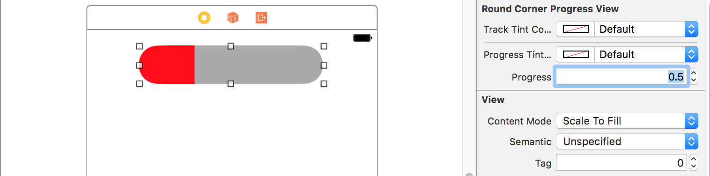
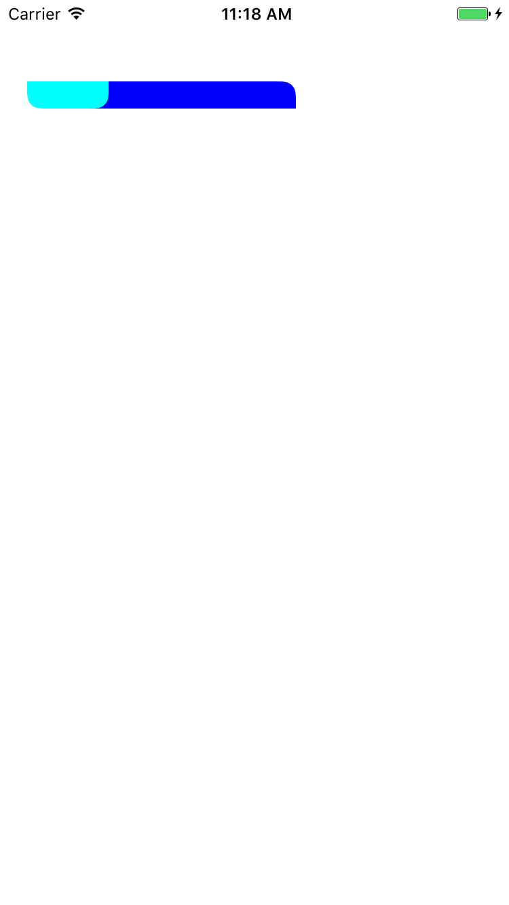

# RoundCornerProgress
[](https://travis-ci.org/phucnm/RoundCornerProgress)
[](https://github.com/Carthage/Carthage)
## Install
**CocoaPods**

Add ```pod 'RoundCornerProgress'``` to your Podfile then ```pod install```

**Carthage**

Add ```github "phucnm/RoundCornerProgress"``` to your Cartfile then ```carthage update```

## Usage
**Using Storyboard / Interface Builder**
* Drag a UIView to Storyboard or Interface Builder, change its class to **RoundCornerProgress**
* Customize your progress color in **Attributes inspector** tab


**Manually**
* Import custom control by `import RoundCornerProgress`
* Declare your property `var progressView: RoundCornerProgressView!`
* Initialize your progress view and customize it
```swift
self.progressView = RoundCornerProgressView(frame: CGRect(x: 20, y: 20, width: 200, height: 20))
self.progressView.trackTintColor = UIColor.blue
self.progressView.progressTintColor = UIColor.cyan
self.progressView.trackRoundCorners = [.topRight, .bottomLeft]
self.progressView.progressRoundCorners = [.bottomRight]
view.addSubview(self.progressView)
```


## Authors

[Phuc Nguyen](https://github.com/phucnm)

## License

RoundCornerProgress is available under the MIT license. See the LICENSE file for more info.
